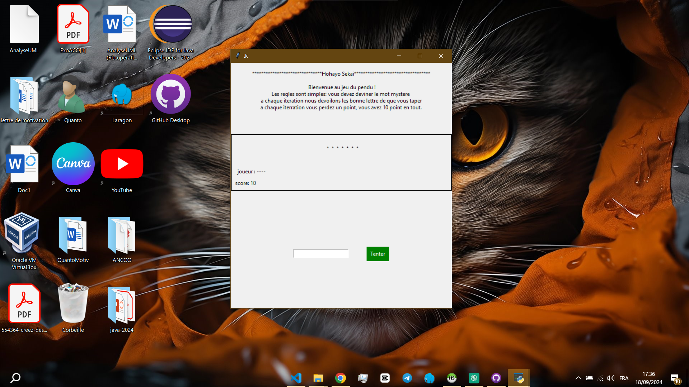

# Jeu du Pendu

 

## Description

Le jeu du pendu est un jeu de mots classique où le joueur doit deviner un mot caché en proposant des lettres. Pour chaque lettre incorrecte, une partie du dessin du pendu est ajoutée. Le joueur gagne s'il devine le mot avant que le dessin ne soit complet.

Ce projet est une implémentation du jeu du pendu réalisé en Python avec la bibliothèque Tkinter pour l'interface graphique.

## Installation

Assurez-vous d'avoir Python installé sur votre machine. Téléchargez le code source du projet et placez-vous dans le répertoire du projet à l'aide de la ligne de commande.

1. Clonez le dépôt (ou téléchargez le code source) :
   ```bash
   git clone https://github.com/AoukouKwadjo/Pendu.git
   ```
   
2. Accédez au répertoire du projet :
   ```bash
   cd <REPERTOIRE-DU-PROJET>
   ```

3. Installez les dépendances nécessaires (si vous en avez) :
   ```bash
   pip install -r requirements.txt
   ```

## Utilisation

Pour lancer le jeu, exécutez le fichier principal `pendu.py` :

```bash
python pendu.py
```

Une fenêtre Tkinter apparaîtra avec l'interface du jeu. Suivez les instructions à l'écran pour jouer.

## Fonctionnalités

- Interface graphique simple et intuitive avec Tkinter.
- Choix aléatoire d'un mot parmi une liste prédéfinie.
- Gestion des entrées utilisateur avec vérification des lettres proposées.
- Affichage de l'état du mot à deviner et du dessin du pendu.
- Gestion des erreurs et affichage des lettres déjà proposées.

## Auteurs

- **Aoukou Kwadjo Raphael** : Développeur principal et concepteur du jeu.

## Contribuer

Les contributions sont les bienvenues ! Veuillez créer une demande de tirage (pull request) pour proposer des modifications ou des améliorations.

## License

Ce projet est sous la [Licence MIT](LICENSE).
